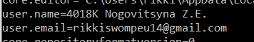
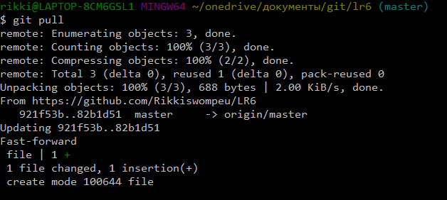
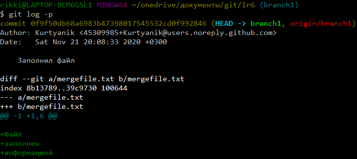
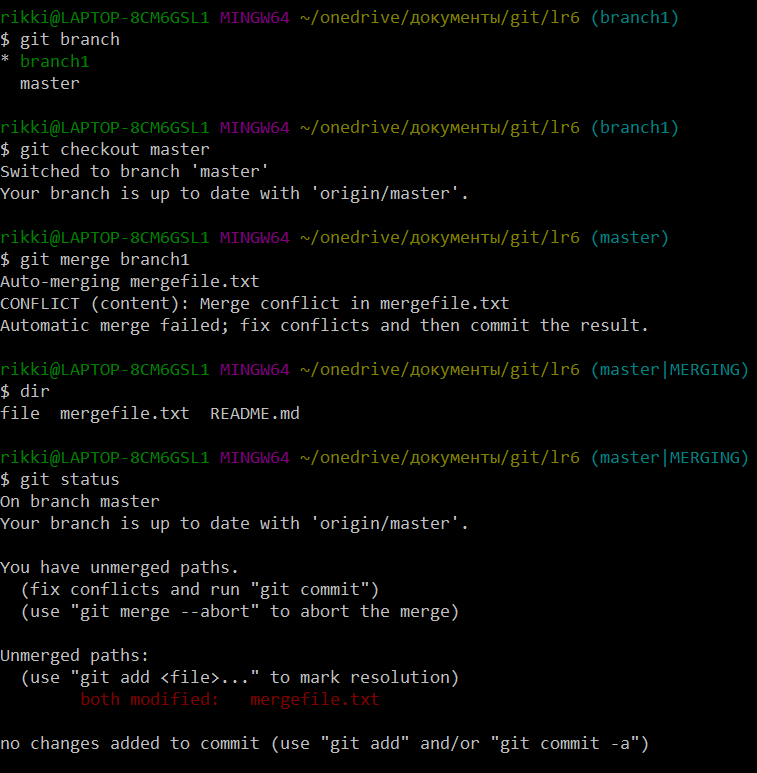
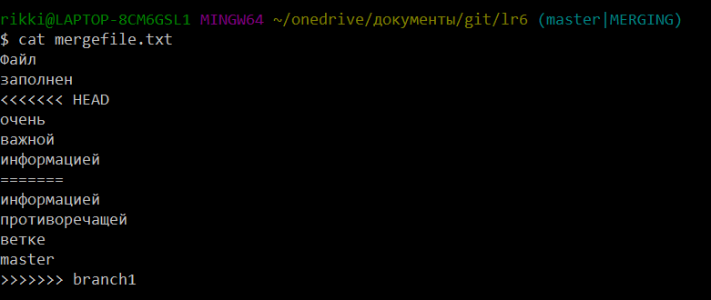
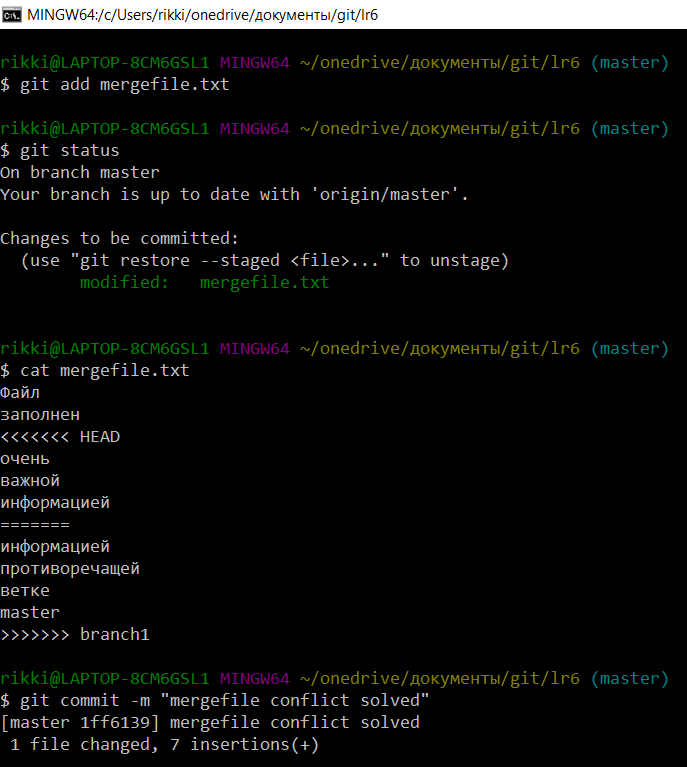
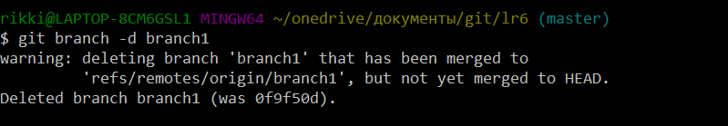
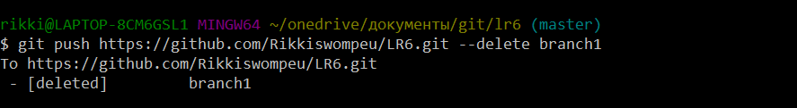
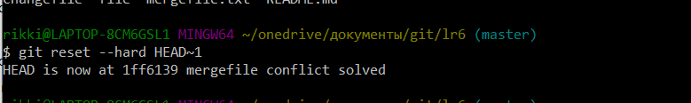

# LR6
Лабораторная работа №6

Настройка после установки Git, введено имя пользователя (4018к Nogovitsyna Z.E.) и email.


Добавляется файл через интерфейс GitHub. Подтягиваются изменения в локальный репозиторий с помощью команды ```git pull```.


Получены истории операций для каждой из веток с помощью команды ```git log```.
.png)
.png)

Просмотрены последние изменения с помощью команды ```git log -p```.


Выполнено слияние в ветку master с помощью команды ```git merge branch1```, возникает конфликт, решаем его, используя команду ```git add mergefile.txt```, и оставляем коммит с помощью команды ```git commit -m "mergefile conflict solved"```.




Удалена побочная ветка после успешного слияния с помощью команды ```git branch -d branch1``` для локального репозитория и команды ```git push https://github.com/Rikkiswompeu/LR6.git --delete branch1``` для удаленного репозитория.



Изменения сделаны и зафиксированы с помощью команды ```git add .```, оставлен коментарий ```git commit```.
.png)

Сделан "хард" откат коммита командой ```git reset --hard HEAD~1```.


Создана ветка для отчета с помощью команд ```git branch report``` и ```git checkout repor```.
.png)

Оформлен отчет в файле README.md 

Получена история операций в форматированном виде, сделана финальная фиксация изменений.


Отчет зафиксирован с помощью команды ```git add .```, оставлен коментарий ```git commit```.

Отправлены локальные изменения в сетевое хранилище GitHub с помощью команды ```git push```.
